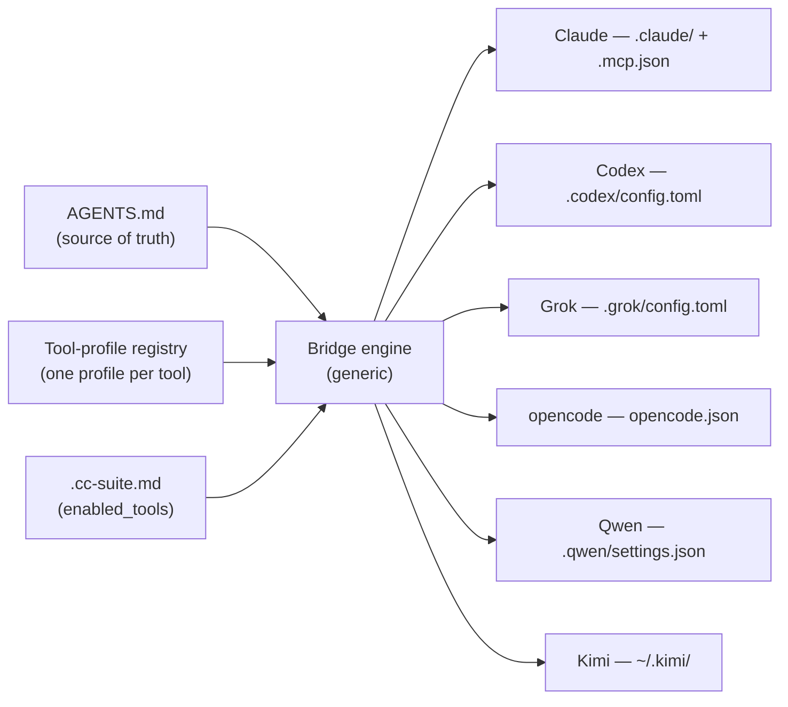

# Supporting more coding agents (and a China-first lens)

A design proposal for how `cc-suite` should scale beyond Claude Code / Codex CLI / Antigravity to additional agentic coding CLIs — **Grok Build, opencode, Qwen Code, Kimi CLI, and others** — as **user-selectable** targets, with an explicit look at which tools are actually usable in **mainland China**.

**This is a design document only. No code changes are proposed here** — it defines the architecture, the per-tool adapter specs, and the selection model so implementation can be scoped and sequenced afterward.

Research verified against primary sources (official docs + repos) as of July 2026. Model IDs and hosted-endpoint availability move monthly; treat every version/URL as "verify at implementation time" and see [§10 Open questions](#10-open-questions--fast-moving-risks).

---

## Table of contents

1. [The core finding: the ecosystem converged](#1-the-core-finding-the-ecosystem-converged)
2. [Two layers of "support"](#2-two-layers-of-support)
3. [What's free vs what needs a per-tool adapter](#3-whats-free-vs-what-needs-a-per-tool-adapter)
4. [Proposed architecture: a tool-profile registry](#4-proposed-architecture-a-tool-profile-registry)
5. [User-selectable options](#5-user-selectable-options)
6. [Per-tool adapter specs](#6-per-tool-adapter-specs)
7. [China-usability matrix](#7-china-usability-matrix)
8. [Model-endpoint layer (optional phase 2)](#8-model-endpoint-layer-optional-phase-2)
9. [Proposed rollout](#9-proposed-rollout)
10. [Open questions & fast-moving risks](#10-open-questions--fast-moving-risks)
11. [Sources](#11-sources)

---

## 1. The core finding: the ecosystem converged

cc-suite's founding bet — *one `AGENTS.md` as source of truth, mirror the rest into each tool's native format* — is now **reinforced by the wider market**. Two of the five config surfaces became genuine open standards; three stayed fragmented.

| Surface | Status | Consequence for cc-suite |
|---------|--------|--------------------------|
| **Instruction file** | **Converged → `AGENTS.md`** (Linux-Foundation-stewarded; ~23 tools read it natively). Only holdout among CLIs is Claude Code (`CLAUDE.md`), which cc-suite already handles via the `@AGENTS.md` import. | **Near-free.** Every new tool reads the `AGENTS.md` cc-suite already writes. |
| **Skills** | **Converged → `SKILL.md`** (Anthropic published Agent Skills as an open standard, Dec 2025; adopted broadly). Most tools read `.claude/skills/` and/or `.agents/skills/` directly. | **Near-free.** cc-suite's existing `.agents/skills → .claude/skills` symlink already surfaces skills to opencode, Grok, Kimi, and others. |
| **MCP config** | **Fragmented.** Same logical model, different path + format + root key. Three shapes in the wild: JSON `mcpServers`, JSON nested-in-config, TOML `mcp_servers`. No adopted universal path. | **Real per-tool work** — but only 3–4 emit targets, and cc-suite already ships 2 of them. |
| **Hooks** | **Fragmented.** Claude ↔ Codex is a near-clone (JSON-on-stdin). Qwen/Kimi are Claude-shaped. opencode uses TS plugins (codegen, not config). Most others: nothing. | **Per-tool**, and some tools need no hooks target at all. |
| **Commands / subagents** | **Proprietary.** No cross-tool format. Commands are being absorbed into skills (Codex is deprecating `prompts/` → skills). | **Don't generalize.** Express commands as skills; leave subagents Claude-only. |

**Headline:** the newer agents you named were deliberately built to consume Claude Code's artifacts. So for most of them, cc-suite's job shrinks to **an MCP emitter plus (sometimes) a hooks emitter** — instructions and skills come for free.

---

## 2. Two layers of "support"

"Support tool X" is ambiguous. It splits into two independent layers, and cc-suite today only owns the first:

1. **Config-surface layer** (cc-suite's job): translate the shared project config — instructions, skills, MCP, hooks — into tool X's native files so tool X sees the same project setup.
2. **Model-endpoint layer** (cc-suite does *not* touch this today): which LLM the tool talks to (`ANTHROPIC_BASE_URL`, OpenAI base URL, API keys). This is what makes a tool *usable in China* — you point an open-source CLI at a domestically-reachable provider.

These are orthogonal. Bridging Grok Build's config surface is trivial, yet Grok is unusable in China because its *endpoint* (`api.x.ai`) is geoblocked. Conversely, Qwen Code needs a config bridge like any other tool, and its endpoint (DashScope) is domestic. **A China-first support story must reason about both layers** — see [§7](#7-china-usability-matrix) and [§8](#8-model-endpoint-layer-optional-phase-2).

---

## 3. What's free vs what needs a per-tool adapter

Native reads by the four target tools (all confirmed against their docs):

| Tool | Reads `AGENTS.md` | Reads `.claude/skills` + `.agents/skills` | Reads Claude hooks / MCP directly |
|------|:---:|:---:|:---:|
| **Grok Build** (xAI, official) | ✅ (+ `CLAUDE.md`, `.claude/rules`) | ✅ `.claude/skills` | ✅ reads `.mcp.json` **and** `~/.claude/settings.json` hooks |
| **opencode** (SST) | ✅ (+ `CLAUDE.md` fallback) | ✅ both paths | ❌ own format |
| **Kimi CLI** (Moonshot) | ✅ | ✅ both paths | ❌ own format |
| **Qwen Code** (Alibaba) | ✅ (v0.11.1+) | via symlink target | ❌ Claude-shaped, own path |

The **only** genuinely per-tool work that remains:

| Surface | Effort per new tool | Notes |
|---------|--------------------|-------|
| Instructions | ~0 | `AGENTS.md` already written. |
| Skills | ~0 (or one symlink) | Existing symlink covers Grok/opencode/Kimi; Qwen wants its own `.qwen/skills → .claude/skills`. |
| **MCP** | Low–medium | Pick one of 3 emit shapes + target path. |
| **Hooks** | 0 → medium | Grok reads Claude's directly (0). Qwen/Kimi are Claude-shaped translations. opencode needs a generated TS plugin (defer). |
| Commands | 0 | Represent as skills. |
| Subagents | — | Not generalized. |

---

## 4. Proposed architecture: a tool-profile registry

cc-suite currently has **bespoke scripts per tool** (`bridge_mcp.sh` for Codex, `bridge_agy_mcp.py` for Antigravity, `mcp_claude.sh`, `bridge_hooks.py`, `bridge_skills.sh`, …). Copy-pasting that pattern for four more tools multiplies the maintenance surface. Since §3 shows the per-tool surface collapses to a tiny declarative shape, the recommendation is to invert the structure: **a declarative tool-profile registry consumed by a generic bridge engine.**



**A tool profile is a declaration, not a script.** Illustrative shape (final format TBD — TOML/JSON/YAML):

```
tool "grok" {
  display_name = "Grok Build (xAI)"
  instructions = "native-agents-md"          # none | claude-import | settings-nudge | native-agents-md
  skills       = "native-claude-path"        # symlink | native-claude-path | own-symlink(<path>) | none
  mcp = {
    format = "toml-mcp_servers"              # json-mcpServers | json-nested | toml-mcp_servers | none
    path   = ".grok/config.toml"
    scope  = "project"                        # project | global
  }
  hooks = "native-claude"                     # none | claude-json | codex-json | toml-array | ts-plugin | native-claude
  china_tier = "C"                            # A | B | C  (see §7)
}
```

**The engine provides a small set of reusable primitives** the profiles select from:

- **3 MCP emitters** (reused across tools): `json-mcpServers` (Claude/`.mcp.json`, Qwen, Kimi), `json-nested` (opencode's `opencode.json#mcp`, with `type: local/remote`, `command`-as-array, `environment`), `toml-mcp_servers` (Codex, Grok). cc-suite already has 2 of these.
- **Hooks emitters:** `claude-json` passthrough, `codex-json` (existing), `toml-array` (Kimi), and a deferred `ts-plugin` generator (opencode).
- **Skills linker:** symlink management (existing).
- **Instruction glue:** `@AGENTS.md` import (Claude, existing) and `settings-nudge` (add `AGENTS.md` to a tool's `context.fileName`, for GEMINI.md/QWEN.md-default tools when not already default).

Adding a tool becomes: *write one profile; reuse existing emitters.* The current per-tool scripts get refactored to be the first registry entries (Claude, Codex, Antigravity), so behavior is preserved.

**Explicitly out of scope for the engine:** subagents (no portable format), and any attempt to translate command *bodies* between injection syntaxes — represent commands as skills instead.

---

## 5. User-selectable options

Selection rides on the existing per-project `.cc-suite.md` config (already generated by `/cc-suite:init`). Add one section:

```markdown
## Enabled Tools

Which coding agents cc-suite bridges in this project. Remove a line to stop
targeting that tool; re-run /cc-suite:repair after editing.

- claude          # always on (source of truth)
- codex
- antigravity
# - grok
# - opencode
# - qwen
# - kimi
```

Mechanics:

- **`/cc-suite:init`** presents a checklist (multi-select). It can pre-tick tools it detects on `PATH` (`grok`, `opencode`, `qwen`, `kimi`, `codex`, `agy`) and, when a China locale/registry is detected, surface the China-tier annotation from §7 so the user picks with eyes open.
- **Every bridge / `diagnose` / `repair` command iterates the enabled set** instead of hardcoding three tools.
- **A `--tools grok,opencode` flag** overrides the enabled set for one-off runs.
- **Default stays `claude, codex, antigravity`** so existing projects are unaffected.

Claude is always implicitly on — it is the source of truth the others mirror from.

---

## 6. Per-tool adapter specs

Ranked by integration effort (cheapest first). "Free" = handled by cc-suite's existing `AGENTS.md` + skills symlink.

### 6.1 Grok Build (xAI, official) — near-zero effort

- **What it is:** xAI's official Rust CLI coding agent (`xai-org/grok-build`, Apache-2.0, binary `grok`), explicitly built for Claude-Code compatibility. **Not** the community `superagent-ai/grok-cli`, which has a different `.grok/` layout — do not conflate.
- **Instructions / skills / hooks:** **free.** Reads `AGENTS.md`, `CLAUDE.md`, `.claude/rules`, `.claude/skills`, `.mcp.json`, and `~/.claude/settings.json` hooks out of the box.
- **MCP (optional native mirror):** `.grok/config.toml` under `[mcp_servers.<name>]` — nearly identical to Codex's TOML. Reuse the `toml-mcp_servers` emitter with a different path. *Not strictly required* (Grok already reads `.mcp.json`); the mirror only adds project-trust semantics.
- **Divergence:** subagents (`.grok/agents/` markdown or `[subagents.roles.*]` TOML) — leave unbridged.
- **Profile:** `instructions=native-agents-md, skills=native-claude-path, mcp=toml-mcp_servers/.grok/config.toml, hooks=native-claude`.

### 6.2 opencode (SST) — low effort

- **What it is:** MIT, provider-agnostic terminal agent (`sst/opencode`). The most flexible model layer of any tool here (OpenAI *and* Anthropic wire formats, 75+ providers).
- **Instructions / skills:** **free.** Reads `AGENTS.md` (+ `CLAUDE.md` fallback) and both `.claude/skills` and `.agents/skills`.
- **MCP:** `json-nested` emitter into `opencode.json#mcp`. Schema differences to encode: `type: "local"|"remote"` (not `stdio`/`http`); `command` is a **single array** combining command+args; env key is `environment`; remote uses `url`+`headers`+optional `oauth`.
- **Hooks:** no declarative config — hooks are `.opencode/plugins/*.ts` modules on an event bus (`tool.execute.before/after`, `session.idle`, …). Requires a **generated TS shim** that shells out to the same scripts on mapped events. **Defer to a later phase** — low initial value.
- **Profile:** `instructions=native-agents-md, skills=native-claude-path, mcp=json-nested/opencode.json, hooks=ts-plugin(deferred)`.

### 6.3 Kimi CLI (Moonshot) — low effort

- **What it is:** MIT, Python terminal agent (`MoonshotAI/kimi-cli`, evolving into `kimi-code`). China-native (see §7).
- **Instructions / skills:** **free.** Reads `AGENTS.md` and both `.claude/skills` and `.agents/skills`.
- **MCP:** `json-mcpServers` emitter into `~/.kimi/mcp.json` — same `mcpServers` shape as `.mcp.json`.
- **Hooks:** `toml-array` emitter into `~/.kimi/config.toml` `[[hooks]]` (event names ~1:1 with Claude).
- **Divergence / caveat:** MCP + hooks config is **global (`~/.kimi/`), not project-scoped** — weaker per-project isolation than Claude/Codex. Confirm whether a project-level `config.toml`/`mcp.json` is honored before committing to project scope. Custom agents are YAML referencing Python `module:ClassName` tools — **not bridgeable**, skip.
- **Profile:** `instructions=native-agents-md, skills=native-claude-path, mcp=json-mcpServers/~/.kimi/mcp.json(global), hooks=toml-array/~/.kimi/config.toml(global)`.

### 6.4 Qwen Code (Alibaba) — low–medium effort

- **What it is:** Apache-2.0 Gemini-CLI fork (`QwenLM/qwen-code`); everything lives under `.qwen/`, a near-clone of `.claude/`. China-native.
- **Instructions:** **free** on v0.11.1+ (`AGENTS.md` is a default context filename). On older versions, add `AGENTS.md` to `context.fileName` via `settings-nudge`.
- **Skills:** own symlink `.qwen/skills → .claude/skills`.
- **MCP + hooks:** both live in **one consolidated `.qwen/settings.json`** (`mcpServers` + `hooks`, Gemini/Claude-shaped). Emitter must **read-modify-write / merge** JSON, not overwrite. Note `httpUrl` (streamable HTTP) vs `url` (SSE).
- **Divergence:** tool-name vocab (`read_file`/`run_shell_command` vs `Read`/`Bash`) and command injection syntax (`{{args}}`/`!{cmd}`/`@{file}` vs `$ARGUMENTS`) differ — matters only if mirroring subagent tool-lists or command bodies, both of which we skip/represent-as-skills.
- **Profile:** `instructions=native-agents-md(≥0.11.1), skills=own-symlink(.qwen/skills), mcp=json-mcpServers(merge)/.qwen/settings.json, hooks=claude-json(merge)/.qwen/settings.json`.

### 6.5 Already supported

Claude (source of truth), Codex (`toml-mcp_servers` + `codex-json` hooks + `.codex/prompts`), Antigravity/`agy` — become the first three registry profiles during the refactor.

---

## 7. China-usability matrix

This is the lens the "which open-source CLI is supportable in China" question demands. **Config-bridge ease and China-usability are different axes**, and they conflict for exactly the two easiest-to-bridge tools.

### 7.1 CLI verdict (config layer + endpoint reachability)

| Tier | Meaning | Tools |
|------|---------|-------|
| **A — works great in China** | China-native, or trivially provider-agnostic; no foreign login/infra required | **Qwen Code**, **Kimi CLI**, **opencode**, aider, Cline |
| **B — works with friction** | Runs if pointed at a domestic Anthropic/OpenAI-compatible endpoint, but has login/telemetry/protocol friction | **Claude Code** (point `ANTHROPIC_BASE_URL` at a domestic endpoint → skips the geoblocked Anthropic login; not open source; telemetry GFW-blocked but non-fatal, disable with `CLAUDE_CODE_DISABLE_NONESSENTIAL_TRAFFIC=1`), **Codex CLI** (ChatGPT login is geoblocked → use API-key/custom-provider mode; Responses-API-only means most domestic Chat-Completions endpoints need a translating proxy), Continue (`cn`) |
| **C — effectively VPN-only** | Intended provider/account region-locked out of mainland China | **Grok Build** (xAI `api.x.ai` needs VPN + foreign card), **Gemini CLI**, **Google Antigravity** (region-locked at the account level) |

**The irony to flag honestly:** the two tools with the *cheapest* config bridge — **Grok Build** (§6.1, reads everything natively) and **Antigravity** (already supported) — are **Tier C** in China. And Antigravity is cc-suite's current default third target. This isn't an argument to drop them; it's an argument that **the enabled-tools default and the `init` picker should be China-aware**: surface the tier so a China-based user isn't nudged toward a VPN-only tool.

### 7.2 Domestic model providers (the endpoint layer)

All of these expose an **Anthropic-compatible** endpoint (so any Anthropic-API CLI can `ANTHROPIC_BASE_URL`-swap) and/or an OpenAI-compatible one, reachable in mainland China without a VPN. Endpoints are stable; **model IDs churn — treat as config values, not constants.**

| Provider | Anthropic endpoint (mainland) | OpenAI endpoint (mainland) | First-party CLI | Open weights |
|----------|-------------------------------|----------------------------|-----------------|:---:|
| **Zhipu GLM** | `open.bigmodel.cn/api/anthropic` | `open.bigmodel.cn/api/paas/v4` | — (markets Claude Code) | ✅ |
| **Alibaba Qwen** | `dashscope.aliyuncs.com/apps/anthropic` | `dashscope.aliyuncs.com/compatible-mode/v1` | ✅ qwen-code | ✅ |
| **Moonshot Kimi** | `api.moonshot.cn/anthropic` | `api.moonshot.cn/v1` | ✅ Kimi CLI | ✅ |
| **DeepSeek** | `api.deepseek.com/anthropic` | `api.deepseek.com/v1` | — | ✅ |
| **MiniMax** | `api.minimaxi.com/anthropic` | `api.minimaxi.com/v1` | — | ✅ |
| **ByteDance Ark** | `ark.cn-beijing.volces.com/api/coding` | `ark.cn-beijing.volces.com/api/v3` | — (Trae IDE) | ❌ |

Ranked for backing an open-source coding CLI in China (Anthropic-endpoint + strong coding model + accessibility + price): **GLM → Qwen → Kimi → DeepSeek → MiniMax → Ark**.

### 7.3 Recommended China-first support set

- **Default-recommend (Tier A):** Qwen Code, Kimi CLI, opencode. These are the "just works in China" core.
- **Support with documented caveats (Tier B):** Claude Code and Codex CLI as *bridges to a domestic endpoint* — cc-suite's existing targets, plus an endpoint-config note (§8).
- **Mark VPN-only (Tier C):** Grok Build, Antigravity, Gemini — still selectable, but the `init` picker labels them so China users aren't surprised.

---

## 8. Model-endpoint layer (optional phase 2)

cc-suite today bridges *config* but says nothing about *which model endpoint* a tool uses. For a China-first workflow, the endpoint swap is the load-bearing step. Two options, in increasing scope:

1. **Document only (recommended first).** A short reference (this doc's §7.2 + a `dev-docs` snippet) listing domestic base URLs and the exact env vars per tool (`ANTHROPIC_BASE_URL`/`ANTHROPIC_AUTH_TOKEN` for Claude Code & Grok-harness; `[model_providers.*]` for Codex; `opencode.json` provider block; native for Qwen/Kimi). Zero new machinery.
2. **A provider profile in `.cc-suite.md` (later).** An optional `## Model Provider` section (e.g. `provider = glm`, keys via env) that the engine could translate into each enabled tool's endpoint config. This is a real feature with real scope (secret handling, per-tool env wiring) — **defer** until the config-bridge registry lands, and only build it if users actually want cc-suite managing endpoints rather than their shell profile.

Guardrail: **never write API keys into committed files.** `.codex/config.toml` is commit-whitelisted in cc-suite; endpoint URLs are fine there, secrets are not — keep keys in env, mirror only non-secret base URLs (this matches the existing `bridge-mcp` env-redaction behavior).

---

## 9. Proposed rollout

Ordered by ROI and risk:

1. **Registry refactor (foundational).** Convert the three existing per-tool scripts into declarative profiles + a generic engine with the shared emitters. No user-visible change; unlocks everything else.
2. **Grok Build.** Almost free — declare the profile; it already reads Claude artifacts. Great proof of the registry. (Ships as selectable but China-tier-C-labeled.)
3. **opencode + Kimi CLI.** One MCP emitter each (`json-nested`, `json-mcpServers`); skills/instructions free. Both high-value for a China-first + open-source audience.
4. **Qwen Code.** The consolidated `.qwen/settings.json` merge is the only fiddly part.
5. **Selection UX.** `## Enabled Tools` in `.cc-suite.md`, the `init` checklist with China-tier labels, `--tools` flag, and `diagnose`/`repair` iteration.
6. **Endpoint docs (§8 option 1).** A domestic-provider reference.
7. **Deferred:** opencode hooks TS-plugin generator; the §8 option-2 provider profile.

An alternative ordering ships Grok first *without* the refactor (to validate the profile shape against a real tool), then refactors. Either is defensible; the refactor-first path avoids a throwaway bespoke Grok script.

---

## 10. Open questions & fast-moving risks

- **Model IDs & hosted endpoints churn monthly.** Every model name and base URL in §7 must be re-verified at implementation time; wire to endpoints, not model IDs.
- **Grok official vs community.** "grok build" = `xai-org/grok-build`. The community `superagent-ai/grok-cli` uses a different `.grok/` layout (`settings.json`, `~/.grok/user-settings.json`). The registry must target one; default to the official Rust CLI.
- **Kimi = model or tool?** "Support Kimi" can mean *the Kimi CLI product* (a config-bridge target, §6.3) **or** *Kimi K2 as a model inside Claude Code* (an endpoint swap, §8, cc-suite no-op). The design supports the former and documents the latter.
- **Kimi global-scope config.** Confirm project-level `~/.kimi` overrides exist before promising project isolation.
- **Codex Responses-API-only.** Recent Codex config docs list only `wire_api = "responses"`; domestic Chat-Completions endpoints may need a translating proxy (LiteLLM). Verify current behavior before documenting a domestic-Codex path.
- **Qwen OAuth free tier ended (2026-04-15).** Endpoint docs should point to DashScope/ModelStudio keys, not the retired OAuth free tier.
- **Roo Code archived (2026-05-15).** Do not add as a target; steer to Cline.
- **Subagents remain unportable.** No cross-tool format; keep Claude-only. Revisit only if a standard emerges.

---

## 11. Sources

Primary docs and repos consulted (July 2026):

- **AGENTS.md / standards:** agents.md · anthropic.com/engineering/equipping-agents-for-the-real-world-with-agent-skills · modelcontextprotocol discussion #2218 (universal MCP config, still a proposal)
- **opencode:** opencode.ai/docs (rules, mcp-servers, plugins, commands, agents, skills, config, providers)
- **Qwen Code:** github.com/QwenLM/qwen-code · qwenlm.github.io/qwen-code-docs (memory, mcp, hooks, commands, sub-agents, skills, auth) · PR #2018 (AGENTS.md default)
- **Grok Build:** github.com/xai-org/grok-build · docs.x.ai/build · x.ai/news/grok-build-cli · community: github.com/superagent-ai/grok-cli
- **Kimi CLI:** github.com/MoonshotAI/kimi-cli · moonshotai.github.io/kimi-cli · github.com/MoonshotAI/kimi-code
- **China endpoints:** alibabacloud.com/help (DashScope Claude Code + OpenAI-compat) · platform.moonshot.ai · docs.z.ai (GLM Claude Code) · api-docs.deepseek.com/guides/anthropic_api · platform.minimax.io/docs · volcengine.com/docs (Ark) · github.com/Alorse/cc-compatible-models
- **China CLI usability:** aider.chat/docs/llms/openai-compat · docs.cline.bot/provider-config/openai-compatible · docs.continue.dev/guides/cli · github.com/openai/codex issue #14215 (region block) · anthropics/claude-code issue #58383 (telemetry env var)

Secondary/aggregated sources (adoption counts, tool lists) are directional and fast-moving — verify specifics against primary docs before implementation.
